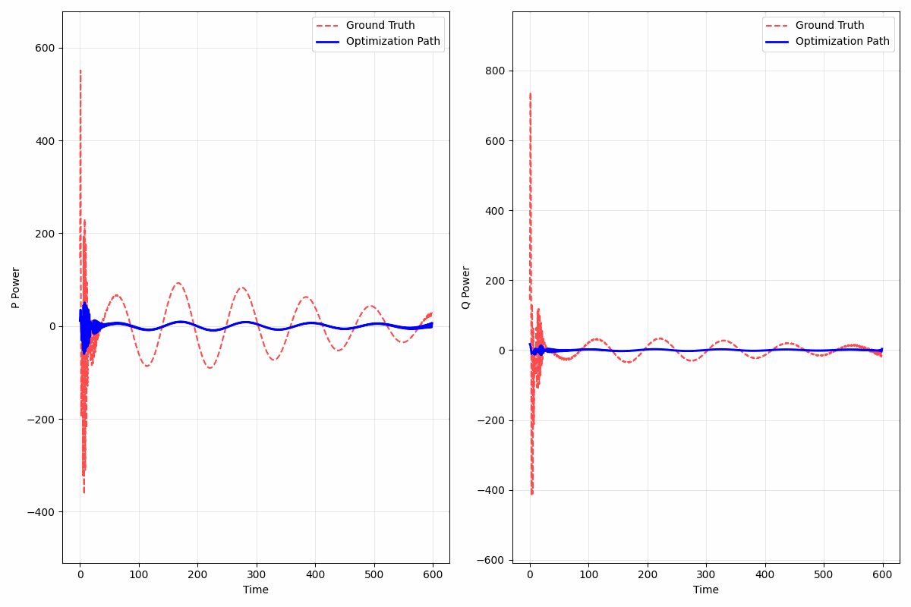
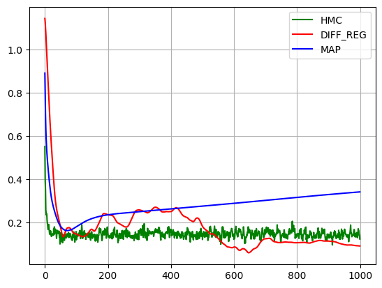

# Solving Inverse Problem by Diffusion Score Matching Regularizer

## Disription




### Run GP Inverse Model
```
python run_reddiff_gp.py --config-name=gp_run
```
## Inverse Problem Model

### Gaussian Process Regression

### Mollified Prior Distribution

### Variational Optimization Objective

### Score Function Estimation

## Dataset

We simulate the power output of a solar pv model from an open source 

## Performance and Sensitive Analysis

## Quick Run GP Inverse Problem with default configuration
```
python scripts/run_demo.py --config-name=ddrmpp algo.repeat=1 algo.obs_weight=1.0 dataset.index=1 dataset.list=False
```
Distributed Run
```
torchrun --standalone --nproc_per_node=3 scripts/run_demo.py --config-name=ddrmpp algo.repeat=1 algo.obs_weight=1.0 dataset.index=1 dataset.list=False algo=reddiff_vvgp_parallel algo.batch_size=1
```
```
torchrun --standalone --nproc_per_node=3 scripts/run_demo_parallel.py --config-name=ddrmpp algo.repeat=1 algo.obs_weight=1.0 dataset.index=9 dataset.list=True algo=reddiff_vvgp algo.batch_size=10
```

#### Run with experimental configuration
```
torchrun --standalone --nproc_per_node=3 scripts/run_demo_parallel_exp.py --config-name=ddrmpp algo=reddiff_vvgp_exp algo.repeat=1 algo.obs_weight=1.0 dataset.index=9 dataset.list=True algo.batch_size=10 algo.projection=False algo.moving_delay=False algo.truncate=False algo.grad_term_weight=1.5
```

```
python scripts/run_demo_exp.py --config-name=ddrmpp algo=reddiff_vvgp_exp algo.repeat=1 algo.obs_weight=1.0 dataset.index=0 dataset.list=False  algo.projection=False  
```


<!-- ```
python run_reddiff_gp.py --config-name=gp_run algo.repeat=1 algo.obs_weight=0.0 dataset.index=0 dataset.list=False
```

```
python run_reddiff_gp.py --config-name=gp_run algo.optim=Adam algo.repeat=1 algo.obs_weight=1.0 dataset.index=1048 dataset.list=False
``` -->

Modern power-system applications frequently require learning the mapping from model parameters to multivariate trajectories and, in the opposite direction, inferring parameters from observed time series.
In this report we address both directions for the active/reactive power outputs \([P(t),Q(t)]\) of an inverter–interfaced solar PV model. We model the stacked trajectory by a Gaussian Process Regression model.
Beyond the forward surrogate, we formulate an inverse problem: given an observed trajectory \(\mathbf y\), infer a plausible \(\theta\). We propose a Gaussian kernel mollified prior for the sampling target
and develop a variational objective in which the intractable score-matching objective is replaced by a stochastic optimal control target along a variance-preserving diffusion. 
This leads to a flat robust minima in the inverse problem, thus has smaller error compared to the classical Maximum A Posteriori (MAP) and Hamiltonian Monte Carlo(HMC).
This leads to a controlled reverse SDE whose optimal control equals the data score; in practice it is learned by a neural controller and coupled with the GP likelihood. 
The report presents the numerical results on forward problem, numerical experiments on inverse problem are left to future work.
