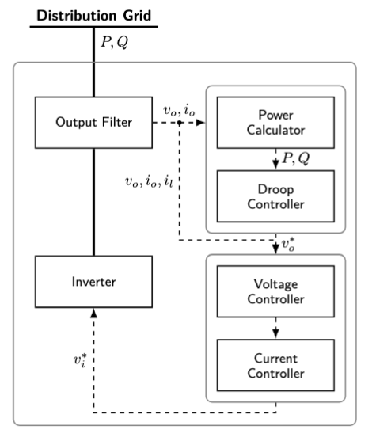

# Solving Inverse Problem by Diffusion Score Matching Regularizer

This repository contains the implementation of diffusion score matching variational inference from the paper **"Parameter Estimation for Dynamic Model in Power System Using Diffusion Score Matching Variational Inference"**. The project solves inverse problems in power systems by inferring model parameters from observed time-series data for inverter-interfaced solar PV systems.


**Figure 1: Playback P/Q trajectories with approximated posterior mean.**

---

## Description

Inverse problems in power systems involve inferring model parameters from observed time-series data. This work addresses the challenge for inverter-interfaced solar PV systems, where observations are active/reactive power trajectories.

**Key components:**
- **Forward surrogate**: A Gaussian Process Regression (GPR) model trained to map parameters to power trajectories
- **Mollified prior**: A Gaussian-kernel-mollified prior distribution for smooth posterior landscapes
- **Variational objective**: Replaces the intractable Kullback-Leibler divergence term with a score matching loss
- **Score estimation**: Unadjusted Langevin sampling for score function estimation

Numerical simulations show that the proposed method achieves flatter, more robust minima than Maximum a Posteriori (MAP) and Hamiltonian Monte Carlo (HMC), with similar error on synthetic PV data.

---

## Dataset

The power output of a solar PV model is simulated using an open source code PSML.

### Solar PV Model Details

The model represents a grid-connected solar PV system governed by differential-algebraic equations (DAEs) covering the following control hierarchy:

*   **Power Calculator**: Computes instantaneous active ($P$) and reactive ($Q$) power
*   **Frequency Droop Controller**: Mimics synchronous generator dynamics for frequency regulation
*   **Cascaded Control Loops**:
    *   **Voltage Controller**: Outer loop regulating reference signals
    *   **Current Controller**: Inner loop providing fast-transient regulation of grid current ($i_d, i_q$)
*   **Output LCL Filter**: Models the physical hardware interface to the grid



### Reference

Please cite the original PSML paper when using this dataset:

> X. Zheng, N. Xu, L. Trinh, D. Wu, T. Huang, S. Sivaranjani, Y. Liu, and L. Xie, "PSML: A Multi-scale Time-series Dataset with Benchmark for Machine Learning in Decarbonized Energy Grids," *arXiv preprint arXiv:2110.06324*, 2021.

---

## Comparison with MAP and HMC

We compare our method with Maximum a Posteriori (MAP) and Hamiltonian Monte Carlo (HMC). The following table shows parameter estimation results for selected parameters (Sobol indices). Ground truth values and estimates from DSM-VI (DIFF\_REG), MAP, and HMC methods, along with absolute relative errors:

| Parameter | Ground Truth | DSM-VI Estimate | DSM-VI Error | MAP Estimate | MAP Error | HMC Estimate | HMC Error |
|-----------|--------------|-----------------|--------------|--------------|-----------|--------------|-----------|
| T_f | 13633.37 | 13638.72 | **0.0392%** | 13603.92 | 0.2160% | 13675.04 | 0.3056% |
| D_f | 14142.41 | 14154.29 | **0.0840%** | 14089.94 | 0.3710% | 14238.42 | 0.6789% |
| w_c | 38.0366 | 38.1378 | **0.2662%** | 37.820358 | 0.5685% | 37.5981 | 1.1529% |
| K_iv | 363.0805 | 361.2961 | **0.4915%** | 381.521114 | 2.9083% | 372.3261 | 2.5464% |
| C_f | 0.009582 | 0.009403 | **1.8664%** | 0.010376 | 3.7625% | 0.009927 | 3.6001% |
| F | 0.643698 | 0.636580 | **1.1057%** | 0.731432 | 5.4527% | 0.651178 | 1.1621% |

The displayed Root Mean Square Error (RMSE) of the critical parameters compared to the ground truth during the optimization process illustrates that the diffusion-based mollification effectively smooths the multi-modal posterior landscape, preventing the optimizer from trapping in local minima.


**Figure 2: Convergence of critical parameters during Optimization/sampling.**

---

## Installation

```bash
# Clone the repository
git clone <repository-url>
cd reddiff-gp-demo

# Install dependencies
pip install -r requirements.txt
```

### Requirements
- Python >= 3.8
- PyTorch >= 1.9.0
- Hydra >= 1.3.0
- GPyTorch >= 1.9.0
- NumPy >= 1.21.0
- Matplotlib >= 3.5.0

### External Dependencies
The project requires the following packages to be available at the specified paths:
- `/home/xim22003/Diffusion_CLM/slips`
- `/home/xim22003/Diffusion_CLM/sde_sampler/sde_sampler`

---

## Quick Start

### Single Device Run

```bash
python scripts/run_demo_exp.py --config-name=ddrmpp algo=reddiff_vvgp_exp algo.repeat=1 algo.obs_weight=1.0 dataset.index=0 dataset.list=False algo.projection=False
```

### Distributed Run with Multiple GPUs

```bash
torchrun --standalone --nproc_per_node=3 scripts/run_demo_parallel_exp.py --config-name=ddrmpp algo=reddiff_vvgp algo.repeat=1 algo.obs_weight=1.0 dataset.index=9 dataset.list=True algo.batch_size=1 algo.truncate=False algo.grad_term_weight=.25
```

---

## Hyperparameter Tuning

We provide scripts for hyperparameter tuning focusing on `delay_schedule`. The optimization steps are fixed at 1000, and `num_diffusion_timesteps` and `exp.start_step` are set to `1000 + delay_schedule`.

**Configuration files:**
- `configs/tuning.yaml`: Base configuration for sequential tuning
- `configs/tuning_parallel.yaml`: Configuration for distributed tuning with list of `delay_schedules`

### Sequential Tuning (Single GPU)

```bash
python scripts/run_tuning.py --index=0 --delay_schedule_list=200,300,500 --config-name=tuning --script=run_demo.py --gpu=0
```

### Distributed Tuning

Uses `torch.distributed` with each rank picking a different `delay_schedule` from the config list:

```bash
torchrun --standalone --nproc_per_node=3 scripts/run_tuning_distributed.py --config-name=tuning_parallel dataset.index=2
```

The `tuning_parallel.yaml` config contains `delay_schedules: [200, 300, 500]`. Each rank will use one value from this list. Additional Hydra overrides can be passed via command line.

---

## Project Structure

```
.
├── configs/                  # Hydra configuration files
│   ├── algo/                 # Algorithm configurations
│   ├── dataset/              # Dataset configurations
│   ├── diffusion/            # Diffusion model configurations
│   ├── exp/                  # Experiment configurations
│   └── model/                # Model configurations
├── data/
│   ├── datasets/             # Input/output data files
│   ├── models/               # Pretrained GP models
│   └── ckpt/                 # Checkpoints
├── notebooks/                # Jupyter notebooks for analysis
├── scripts/                  # Execution scripts
│   ├── run_demo.py           # Single GPU demo
│   ├── run_demo_parallel.py  # Distributed version
│   ├── run_demo_exp.py       # Experimental single device
│   ├── run_demo_parallel_exp.py  # Experimental distributed
│   ├── run_tuning.py         # Sequential tuning
│   └── run_tuning_distributed.py # Distributed tuning
└── src/
    ├── algo/                 # Core algorithms
    │   ├── algorithm.py      # REDDIFF class
    │   ├── forward_model.py  # GP forward model
    │   ├── score_estimator.py# Score estimation
    │   └── benchmark.py      # MAP and HMC benchmarks
    └── utils/                # Utility functions
        ├── diffusion.py      # Diffusion process
        └── vvgp.py           # Variational GP utilities
```

---

## Key Configuration Parameters

| Parameter | Description | Default |
|-----------|-------------|---------|
| `algo.delay_schedule` | Diffusion delay steps | 600 |
| `algo.lr` | Learning rate | 0.1 |
| `algo.grad_term_weight` | Gradient term weight | 0.25 |
| `algo.obs_weight` | Observation weight | 1.0 |
| `diffusion.num_diffusion_timesteps` | Total diffusion steps | 1600 |
| `dataset.index` | Sample index to process | 0 |
| `dataset.list` | Process multiple samples | False |

---

## Citation

If you use this code in your research, please cite:

```bibtex
@article{ma2026parameter,
  title={Bayesian Parameter Estimation for Dynamic Inverter-based Resource Models using Diffusion Score Matching Variational Inference},
  author={Ma, Xiaohang and Tan, Bendong and Jang, Sunho and Yue, Meng},
  journal={Submitted to PMAPS 2026},
  year={2026}
}
```

---

## License

This project is released under the MIT License.
