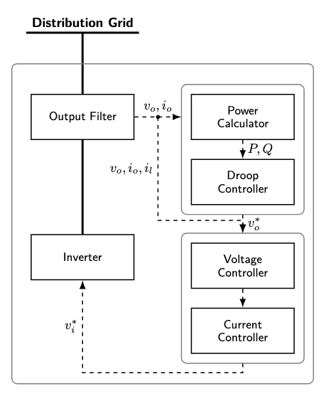

# Solving Inverse Problem by Diffusion Score Matching Regularizer

This is the code for the implementation of diffusion score matching variational inference in the paper **Parameter Estimation for Dynamic Model in Power System
Using  Diffusion Score Matching Variational Inference**. It contains an overview of the project, instructions for installation and usage, and simulation results.


## Description
In this paper we solve inverse problems in power systems involves inferring model parameters from observed time-series data. We address this challenge for inverter-interfaced solar PV systems, where the observations active/reactive power trajectories. A Gaussian Process Regression forward surrogate is first trained to map parameters to outputs. For the inverse problem, we introduce a Gaussian-kernel-mollified prior and a variational objective that replaces intractable Kullback-Leibler divergence term by score matching loss. An Unjusted Langiven sampling method is used to obtain the estimation of score funtion. Numerical simulation shows that our proposed method achieves flatter, more robust minima than Maximum a Posteriori and Hamiltonian Monte Carlo, with similiar error on synthetic PV data.


**Figure 1: Playback P/Q trajectories with approximated posterior mean.**

## Dataset

We simulate the power output of a solar pv model from an open source code PMSL

### Solar PV Model Details
The model represents a grid-connected solar PV system. It is governed by differential-algebraic equations (DAEs) covering the following control hierarchy:

*   **Power Calculator:** Computes instantaneous active ($P$) and reactive ($Q$) power.
*   **Frequency Droop Controller:** Mimics synchronous generator dynamics for frequency regulation.
*   **Cascaded Control Loops:**
    *   **Voltage Controller:** Outer loop regulating reference signals.
    *   **Current Controller:** Inner loop providing fast-transient regulation of grid current ($i_d, i_q$).
*   **Output LCL Filter:** Models the physical hardware interface to the grid.

<!-- ### Reference -->

Please cite the original PSML paper when using this dataset:

> X. Zheng, N. Xu, L. Trinh, D. Wu, T. Huang, S. Sivaranjani, Y. Liu, and L. Xie, “PSML: A Multi-scale Time-series Dataset with Benchmark for Machine Learning in Decarbonized Energy Grids,” *arXiv preprint arXiv:2110.06324*, 2021.




## Comparision with MAP and HMC
We compare our method with Maximum a Posteriori (MAP) and Hamiltonian Monte Carlo (HMC). The following table shows parameter estimation results for selected parameters (Sobol indices). Ground truth values and estimates from DSM-VI (DIFF\_REG), MAP, and HMC methods, along with absolute relative errors:

| Parameter | Ground Truth | DSM-VI Estimate | DSM-VI Error | MAP Estimate | MAP Error | HMC Estimate | HMC Error |
|-----------|--------------|-----------------|--------------|--------------|-----------|--------------|-----------|
| T_f | 13633.37 | 13638.72 | **0.0392%** | 13603.92 | 0.2160% | 13675.04 | 0.3056% |
| D_f | 14142.41 | 14154.29 | **0.0840%** | 14089.94 | 0.3710% | 14238.42 | 0.6789% |
| w_c | 38.0366 | 38.1378 | **0.2662%** | 37.820358 | 0.5685% | 37.5981 | 1.1529% |
| K_iv | 363.0805 | 361.2961 | **0.4915%** | 381.521114 | 2.9083% | 372.3261 | 2.5464% |
| C_f | 0.009582 | 0.009403 | **1.8664%** | 0.010376 | 3.7625% | 0.009927 | 3.6001% |
| F | 0.643698 | 0.636580 | **1.1057%** | 0.731432 | 5.4527% | 0.651178 | 1.1621% | 


The Displaied Root Mean Square Error(RMSE) of the critical parameters compared to the ground truth during the optimization process illustrate that the diffusion-based mollification effectively smoothies the multi-modal posterior landscape, preventing the optimizer from trapping in local minima.


 


**Figure 2: Convergence of critical parameters during Optimization/sampling.**


<!-- *  **Y-axis (RMSE):** Displays the Root Mean Square Error of the critical parameters compared to the ground truth.

**Interpretation:** The sharp decline in RMSE during the early steps indicates the effectiveness of the burn-in phase, followed by stabilization as the chain converges to the posterior. -->
<!-- ### Run GP Inverse Model
```
python run_reddiff_gp.py --config-name=gp_run
```
## Inverse Problem Model

### Gaussian Process Regression

### Mollified Prior Distribution

### Variational Optimization Objective

### Score Function Estimation -->


<!-- 
## Performance and Sensitive Analysis

## Quick Run GP Inverse Problem with default configuration
```
python scripts/run_demo.py --config-name=ddrmpp algo.repeat=1 algo.obs_weight=1.0 dataset.index=1 dataset.list=False
```
Distributed Run
```
torchrun --standalone --nproc_per_node=3 scripts/run_demo.py --config-name=ddrmpp algo.repeat=1 algo.obs_weight=1.0 dataset.index=1 dataset.list=False algo=reddiff_vvgp_parallel algo.batch_size=1
```
```
torchrun --standalone --nproc_per_node=3 scripts/run_demo_parallel.py --config-name=ddrmpp algo.repeat=1 algo.obs_weight=1.0 dataset.index=9 dataset.list=True algo=reddiff_vvgp algo.batch_size=10
``` -->

## Run with experimental configuration

### Distributed run with multiple GPUs
```
torchrun --standalone --nproc_per_node=3 scripts/run_demo_parallel_exp.py --config-name=ddrmpp algo=reddiff_vvgp_exp algo.repeat=1 algo.obs_weight=1.0 dataset.index=9 dataset.list=True algo.batch_size=10 algo.projection=False algo.moving_delay=False algo.truncate=False algo.grad_term_weight=1.5
```
### Run with single device
```
python scripts/run_demo_exp.py --config-name=ddrmpp algo=reddiff_vvgp_exp algo.repeat=1 algo.obs_weight=1.0 dataset.index=0 dataset.list=False  algo.projection=False  
```


<!-- ```
python run_reddiff_gp.py --config-name=gp_run algo.repeat=1 algo.obs_weight=0.0 dataset.index=0 dataset.list=False
```

```
python run_reddiff_gp.py --config-name=gp_run algo.optim=Adam algo.repeat=1 algo.obs_weight=1.0 dataset.index=1048 dataset.list=False
``` -->
<!-- 
Modern power-system applications frequently require learning the mapping from model parameters to multivariate trajectories and, in the opposite direction, inferring parameters from observed time series.
In this report we address both directions for the active/reactive power outputs \([P(t),Q(t)]\) of an inverter–interfaced solar PV model. We model the stacked trajectory by a Gaussian Process Regression model.
Beyond the forward surrogate, we formulate an inverse problem: given an observed trajectory \(\mathbf y\), infer a plausible \(\theta\). We propose a Gaussian kernel mollified prior for the sampling target
and develop a variational objective in which the intractable score-matching objective is replaced by a stochastic optimal control target along a variance-preserving diffusion. 
This leads to a flat robust minima in the inverse problem, thus has smaller error compared to the classical Maximum A Posteriori (MAP) and Hamiltonian Monte Carlo(HMC).
This leads to a controlled reverse SDE whose optimal control equals the data score; in practice it is learned by a neural controller and coupled with the GP likelihood. 
The report presents the numerical results on forward problem, numerical experiments on inverse problem are left to future work. -->
